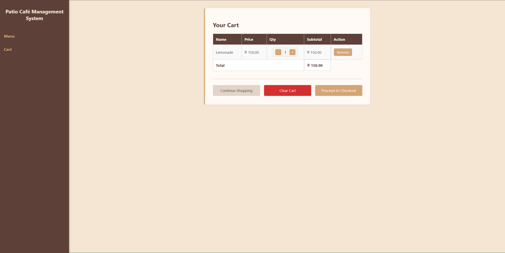
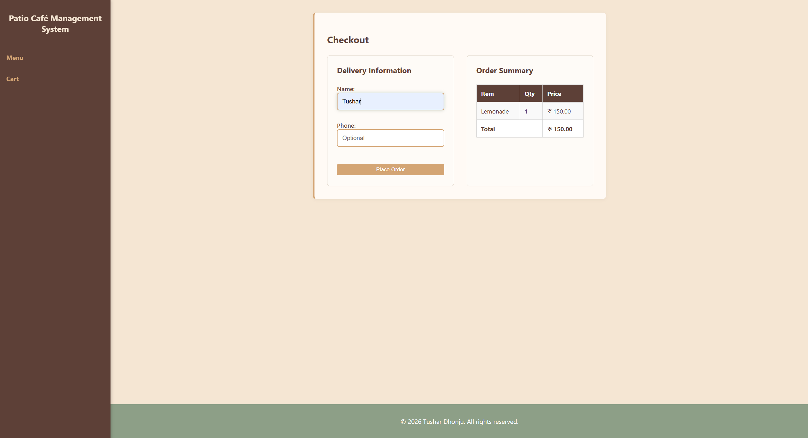
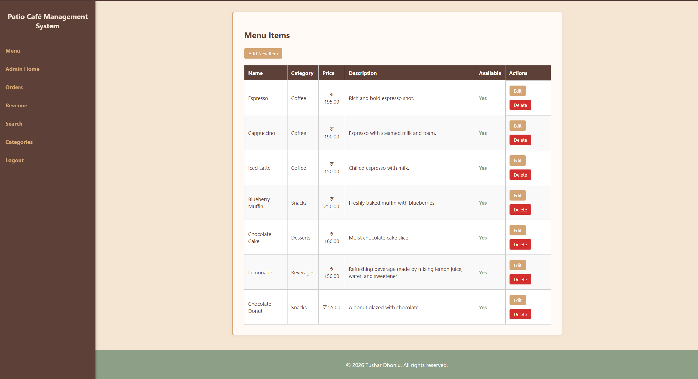
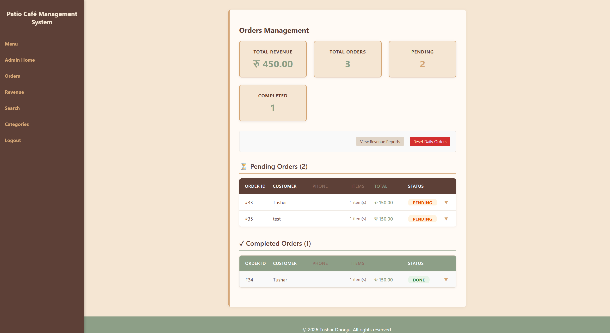
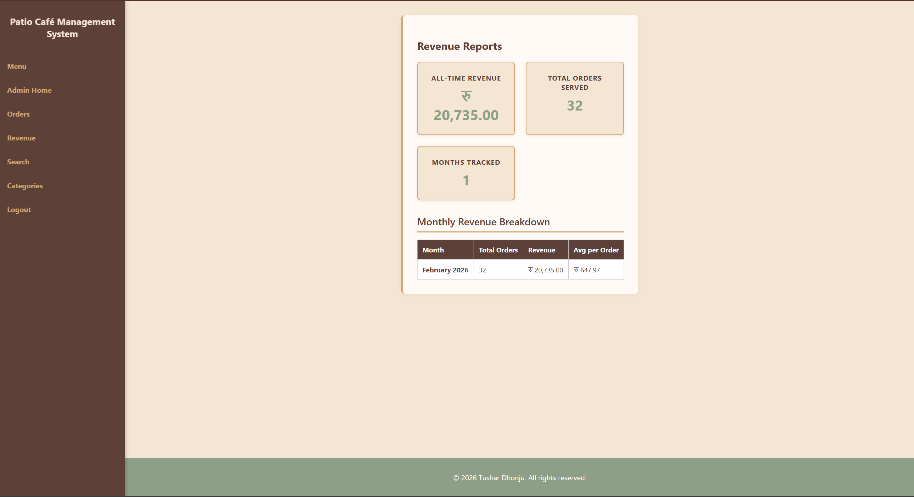
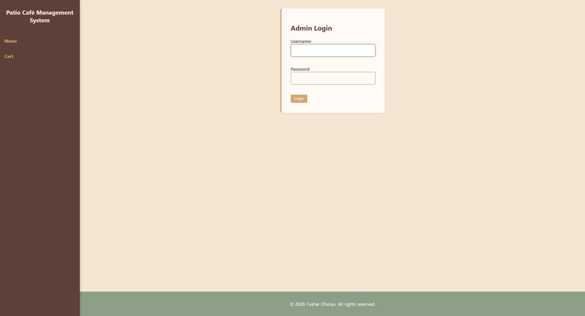

# Patio Café Management System

A simple café management system built with PHP and MySQL.

## Live Demo

- **Menu:** https://student.heraldcollege.edu.np/~np03cs4a240155/final-asessment/public/menu.php
- **Admin Login:** https://student.heraldcollege.edu.np/~np03cs4a240155/final-asessment/public/login.php

## Login Credentials

| Username     | Password    |
| ------------ | ----------- |
| `root_admin` | `123456789` |

## Screenshots

### Menu Page


### Shopping Cart



### Checkout



### Admin Dashboard



### Orders Management



### Revenue Tracking



### Admin Login



## Features

- Browse menu by category
- Add items to cart
- Checkout with customer details
- Admin: Add/Edit/Delete menu items
- Admin: Manage orders
- Admin: Track daily revenue
- Responsive design (works on mobile)

## Tech Stack

- **PHP 8.0+**
- **MySQL**
- **HTML/CSS/JavaScript**
- **Apache (XAMPP)**

## Setup

1. Import `np03cs4a240155.sql` into MySQL
2. Update database credentials in `config/db.php`
3. Access via `http://localhost/final-asessment/public/menu.php`

## Structure

```
final-asessment/
├── assets/css/       → Stylesheets
├── assets/js/        → JavaScript
├── assets/img/       → Images
├── config/           → Database connection
├── includes/         → Header, footer, functions
├── public/           → All pages (menu, cart, admin)
└── np03cs4a240155.sql → Database file
```

## Known Limitations

- No CSRF token protection on forms
- No user registration (admin must be added via database)
- No payment gateway integration
- No email confirmation for orders
- No order history for customers
- Images stored locally (no cloud storage)

---

**Made for Herald College Final Assessment**
